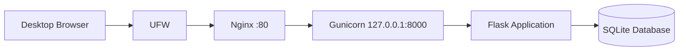
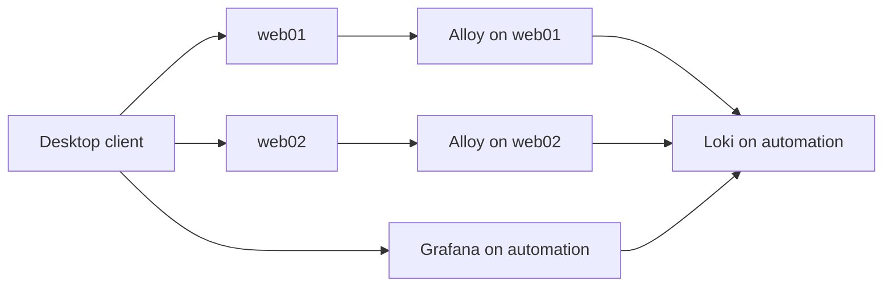

# Employee Directory Architecture

## Production request flow



---

## Component responsibilities

### UFW

Controls inbound network access.

Production currently permits:

- OpenSSH on TCP port 22;
- HTTP on TCP port 80.

Port 8000 is not externally allowed.

### Nginx

Acts as the public HTTP entry point.

Responsibilities include:

- accepting client requests;
- proxying requests to Gunicorn;
- adding security headers;
- producing access and error logs;
- providing a future location for TLS termination.

### Gunicorn

Runs the Flask WSGI application.

Gunicorn listens only on:

```text
127.0.0.1:8000
```

It cannot be accessed directly through the Host-Only network.

### Flask

Implements application routes and business logic.

### SQLite

Stores Employee Directory records.

The database is environment-specific runtime state and is not committed to Git.

### Ansible

Defines and enforces:

- common packages;
- firewall rules;
- application deployment;
- systemd service configuration;
- Nginx configuration;
- deployment validation.

---

## Source-of-truth model

```text
Application Git repository
        |
        v
Application source and dependencies

Infrastructure Git repository
        |
        v
Ansible inventories, roles and templates

Managed server
        |
        v
Generated runtime state
```

Direct server edits create configuration drift and are not part of the normal workflow.

# Centralised Logging Architecture

## Request and logging flow



## Monitoring host

```text
automation
192.168.56.10
```

Hosted services:

```text
Grafana → TCP/3000
Loki    → TCP/3100
```

Grafana and Loki run as Docker containers managed by Docker Compose.

## Log-agent hosts

```text
web01 → production
web02 → staging
```

Grafana Alloy is installed natively as a systemd service.

## Collected sources

```text
employee-directory.service journal
ssh.service journal
/var/log/nginx/access.log
/var/log/nginx/error.log
```

## Standard Loki labels

```text
environment
host
service
```

Examples:

```text
environment=production
host=web01
service=employee-directory
```

```text
environment=staging
host=web02
service=nginx-access
```

## Security boundaries

Grafana is available only from the desktop Host-Only address.

Loki accepts traffic only from approved log-agent addresses.

Alloy’s local web interface binds only to:

```text
127.0.0.1:12345
```

No Docker port publishing is used for Grafana or Loki.

## Source of truth

```text
Git
 ↓
Ansible
 ↓
Docker Compose and Alloy
 ↓
Grafana provisioning
```

Monitoring configuration and dashboards must be updated through the
infrastructure repository rather than maintained only through the Grafana
interface.
