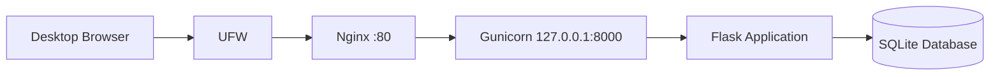

# Employee Directory Architecture

## Production request flow



---

## Component responsibilities

### UFW

Controls inbound network access.

Production currently permits:

- OpenSSH on TCP port 22;
- HTTP on TCP port 80.

Port 8000 is not externally allowed.

### Nginx

Acts as the public HTTP entry point.

Responsibilities include:

- accepting client requests;
- proxying requests to Gunicorn;
- adding security headers;
- producing access and error logs;
- providing a future location for TLS termination.

### Gunicorn

Runs the Flask WSGI application.

Gunicorn listens only on:

```text
127.0.0.1:8000
```

It cannot be accessed directly through the Host-Only network.

### Flask

Implements application routes and business logic.

### SQLite

Stores Employee Directory records.

The database is environment-specific runtime state and is not committed to Git.

### Ansible

Defines and enforces:

- common packages;
- firewall rules;
- application deployment;
- systemd service configuration;
- Nginx configuration;
- deployment validation.

---

## Source-of-truth model

```text
Application Git repository
        |
        v
Application source and dependencies

Infrastructure Git repository
        |
        v
Ansible inventories, roles and templates

Managed server
        |
        v
Generated runtime state
```

Direct server edits create configuration drift and are not part of the normal workflow.
