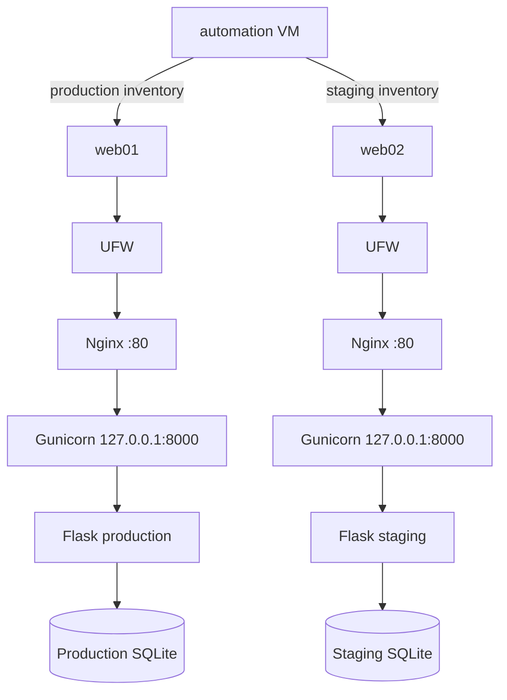

# Production and Staging Environments

## Overview

The Employee Directory application is deployed into two isolated environments:

- production on `web01`;
- staging on `web02`.

Both environments use the same Ansible roles and playbook.

Environment-specific behaviour is controlled through separate inventories and variables.

---

## Environment summary

| Environment | Host    |      IP address | Application revision | Gunicorn workers |
| ----------- | ------- | --------------: | -------------------- | ---------------: |
| Production  | `web01` | `192.168.56.40` | `main`               |                3 |
| Staging     | `web02` | `192.168.56.50` | `develop`            |                2 |

---

## Architecture



---

## Inventory structure

```text
inventories/
├── production/
│   ├── hosts.ini
│   ├── group_vars/
│   │   ├── all.yml
│   │   └── webservers.yml
│   └── host_vars/
└── staging/
    ├── hosts.ini
    ├── group_vars/
    │   ├── all.yml
    │   └── webservers.yml
    └── host_vars/
```

---

## Production inventory

```ini
[webservers]
web01 ansible_host=192.168.56.40
```

Production-wide connection variables are stored in:

```text
inventories/production/group_vars/all.yml
```

Production web-server variables are stored in:

```text
inventories/production/group_vars/webservers.yml
```

---

## Staging inventory

```ini
[webservers]
web02 ansible_host=192.168.56.50
```

Staging-wide connection variables are stored in:

```text
inventories/staging/group_vars/all.yml
```

Staging web-server variables are stored in:

```text
inventories/staging/group_vars/webservers.yml
```

---

## Why separate inventories are used

Separate inventories provide several protections:

- production and staging commands target different host sets;
- production does not accidentally include staging;
- staging does not accidentally include production;
- environment variables remain explicit;
- deployment commands clearly identify the target environment.

Examples:

```bash
ansible-playbook \
  -i inventories/production/hosts.ini \
  playbooks/webservers.yml
```

```bash
ansible-playbook \
  -i inventories/staging/hosts.ini \
  playbooks/webservers.yml
```

A default inventory is deliberately not configured in `ansible.cfg`.

The engineer must specify the target environment explicitly.

---

## Environment variables

### Production

```yaml
deployment_environment: production
employee_app_version: main
employee_app_workers: 3
```

### Staging

```yaml
deployment_environment: staging
employee_app_version: develop
employee_app_workers: 2
```

The same role renders different systemd unit files using these variables.

---

## Variable precedence used in this project

Simplified precedence:

```text
Role defaults
    ↓ overridden by
Inventory group_vars
    ↓ overridden by
Inventory host_vars
    ↓ overridden by
Command-line extra variables
```

Role defaults provide reusable fallback values.

Environment configuration belongs in inventory variables.

Host variables should be used only when one specific host must differ from the rest of its inventory group.

---

## Environment identity

The systemd service sets:

```ini
Environment="DEPLOYMENT_ENVIRONMENT=production"
```

or:

```ini
Environment="DEPLOYMENT_ENVIRONMENT=staging"
```

The Flask health endpoint returns the value:

```json
{
  "environment": "staging",
  "status": "healthy"
}
```

This allows deployment validation to prove that requests reached the expected environment.

---

## Database isolation

Each host owns its own database:

```text
web01
└── /opt/apps/employee-directory/app/employees.db

web02
└── /opt/apps/employee-directory/app/employees.db
```

Although the paths are identical, they refer to separate files on separate virtual machines.

Production and staging must not share SQLite data.

Staging records must not appear in production unless they are created there independently.

---

## Network isolation

Both servers are connected through the Host-Only lab network.

Expected exposed ports:

```text
22/tcp → OpenSSH
80/tcp → Nginx
```

Gunicorn remains bound to:

```text
127.0.0.1:8000
```

Port `8000` must not be exposed through UFW.

---

## Source of truth

### Application source

```text
~/projects/employee-directory
```

### Infrastructure configuration

```text
~/projects/homelab-infrastructure
```

### Runtime state

Runtime resources are generated on the managed hosts.

Generated resources should not be edited manually during ordinary operation.
